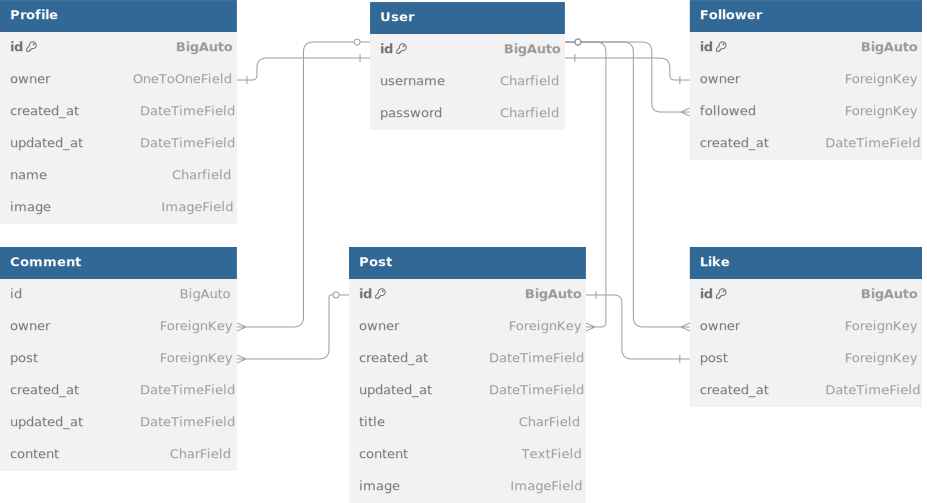

# techstables

## Table of contents
* [User stories](#user-stories)
* [API endpoints](#api-endpoints)
    -   [Api overview](#api-overview)
    -   [Base URL](#base-url)
    -   [Endpoints](#endpoints)
        -   [Profiles](#profiles)
            -   [Profiles Endpoints](#profiles-endpoints)
            -   [Profiles Response example](#profiles-response-example)
        -   [Posts](#posts)
            -   [Posts Endpoints](#posts-endpoints)
            -   [Posts Response Example](#posts-response-example)
        -   [Likes](#likes)
            -   [Likes Endpoints](#likes-endpoints)
            -   [Likes Response Example](#likes-response-example)
        -   [Comments](#comments)
            -   [Comments Endpoints](#comments-endpoints)
            -   [Comments Response Example](#comments-response-example)
        -   [Followers](#followers)
            -   [Followers Endpoints](#followers-endpoints)
            -   [Followers Response Example](#followers-response-example)

* [Database](#database)
    -   [Database Schema](#database-schema)
    -   [User Model](#user-model)
    -   [Profile Model](#profile-model)
    -   [Post Model](#post-model)
    -   [Comment Model](#comment-model)
    -   [Like Model](#like-model)
    -   [Follower Model](#follower-model)
* [Technologies](#technologies)

## User Stories

As a **(role)** I can **(capability)**, so that **(received benefit)**

| User story ID | As A/An  | I want to be able | So that I can...  |
|---------------|----------|-------------------|-------------------|
| Navigation and Authentication|             |           |                   |
| 1 | User |  View a navbar from every page | Navigate easeily between pages |
| 2 | User | Navigate through pages quickly | View content seamlessly without page refresh |
| 3 | User | Create a new account | Access all the features for signed up users |
| 4 | User | Sign in to the app | Access functionality for logged in users |
| 5 | User | Can see if I'm logged in or not | Login if I need to |
| 6 | User | Maintain logged in status until I choose to logout | My user experience is not compromised |
| 7 | User | Logged out user can see sign up and sign in options | Sign up / in |
| 8 | User | View user avatar | Easily identify users of the application |
| Adding and Liking posts |  |  |  |
| 9 | User | Logged in usercan create posts | Share my images with the world |
| 10 | User | View the details of a single post | Learn more about it |
| 11 | User | Logged in user can like a post | Show my support for the post that interest me |
| Posts page |  |  |  |
| 12 | User |View all the most recent posts, ordered by most recently created first | Stay up to date with the newest content |
| 13 | User |Search for posts with keywords | Find posts and user profiles I am most interested in |
| 14 | User | Logged in user can view the post I liked | Find the posts I enjoy the most |
| 15 | User | Logged in user can view content filtered by users I follow | Keep up to date with what they are posting |
| 16 | User | Keep scrolling through the images on the site, loaded automatically | No need to click "Next Page" button |
| Detailed Post Page |  |  |  |
| 17 | User | Can view posts page | Read the comments about the post |
| 18 | Post Owner | Edit my posts title and description | Make correctionsor update my post after it was created |
| 19 | User | Logged in user can add comments to a post | Share thoughts about the post |
| 20 | User | Can see how long ago a comment was made | Know how old are the comments |
| 21 | User | Read the comments on posts | Know what other users think about a specific post |
| 22 | Post owner | Delet my comment | Control Removal of my comment from the application |
| 23 | Post Owner | Edit my comment | Fix or update my existing comment |
| Profile Page |  |  |  |
| 24 | User | View other users profiles | See their post and learn more about them |
| 25 | User | See a list of the most followed profiles | See which profiles are popular |
| 26 | User | View statistics about a specific user: bio, number of posts, follows and users followed | Learn more about the user |
| 27 | User | Logged in user can follow / unfollow other users | See and remove posts by specific users in my posts feed |
| 28 | User | View all the posts by a specific user | Catch up on their latest posts or follow them |
| 29 | Profile Owner | Logged in user can edit own profile | Change profile picture and bio |
| 30 | Profile Owner | Logged in user can update username and password | Change my display name and keep my profile secure |

## API endpoints
* ### API overview
This API powers the Techstables app, enablig users to:
-   Retrieve all profiles or a specific profile
-   Create, retrieve, update, delet posts
-   Manage followers
-   Add and view comments of posts
-   Like and unlike posts

* ### Base URL
-   https://techstables-2157aa5076c9.herokuapp.com

* ### Endpoints
    - #### Profiles
        - ##### Profiles Endpoints
        Retrieve all profiles: `GET` `/profiles` <br>
        Retrieve a single profile: `GET` `/profiles/<int:pk>`

        - ##### Profiles Response Example
        ```
        {
            "count": 4,
            "next": null,
            "previous": null,
            "results": [
                {
                    "id": 11,
                    "owner": "username",
                    "created_at": "14 May 2025",
                    "updated_at": "14 May 2025",
                    "name": null,
                    "image": "image.url",
                    "is_owner": false,
                    "following_id": 2,
                    "posts_count": 0,
                    "followers_count": 1,
                    "following_count": 0
                }
            ]
        }
        ```

    - #### Posts
        -   ##### Posts endpoints
        Retrieve all posts: `GET` `/posts`
        Retrieve specific post: `GET` `/posts/<int:pk>`

        Create a post: `POST` `/posts`
        Update a post: `POST` `/posts/<int:pk>`

        Delete a post: `DELETE` `posts/<int:pk>`


        -   ##### Posts Response Example
        **Retrieve posts**
        ```
        {
            "count": 1,
            "next": null,
            "previous": null,
            "results": [
                {
                    "id": 2,
                    "owner": "username",
                    "is_owner": true,
                    "profile_id": 3,
                    "profile_image": "image.url",
                    "created_at": "21 May 2025",
                    "updated_at": "21 May 2025",
                    "title": "post title",
                    "content": "posts content",
                    "image": null,
                    "like_id": 2,
                    "comments_count": 1,
                    "likes_count": 1
                }
            ]
        }
        ```

        **Create / update a post - inputs**
        ```
        {
            "title": "New Post",
            "content": "This is my new post",
            "images": "image file"
        }
        ```

    - #### Likes
        - ##### Likes endpoints
        Retireve / Create likes: `GET` `/likes`
        Retireve / Delete specific like: `GET` `/likes/<int:pk>`

        - ##### Likes Response Example
        **Retrieve likes**
        ```
            {
                "count": 1,
                "next": null,
                "previous": null,
                "results": [
                    {
                        "id": 2,
                        "created_at": "27 May 2025",
                        "owner": "username",
                        "post": 2
                    }
                ]
            }
        ```

        **Create like for a post - inputs**
        ```
            {
                "post": "post_id"
            }
        ```

    - #### Comments
        - ##### Comments Endpoints
        Retrieve all comments: `GET` `/comments`
        Retrieve specific comment: `GET` `/comments<int:pk>`

        Create a comment: `POST` `/comments`
        Update a comment: `POST` `/comments/<int:pk>`
        
        Delete a comment: `POST` `/comments/<int:pk>`

        - ##### Comments Response Example

        **Retrieve comments**
        ```
            {
                "count": 1,
                "next": null,
                "previous": null,
                "results": [
                    {
                        "id": 2,
                        "owner": "username",
                        "is_owner": true,
                        "profile_id": 3,
                        "profile_image": "image.url",
                        "post": 2,
                        "created_at": "5 months, 2 weeks ago",
                        "updated_at": "5 months, 2 weeks ago",
                        "content": "comment content"
                    }
                ]
            }
        ```

        **Create / Update comment - inputs**
        ```
            {
                "content": "comment content"
            }

        ```

    - #### Followers
        - ##### Followers Endpoints
        Retrieve all followers: `GET` `/followers`
        Retrieve a specific follower: `GET` `/followers<int:pk>`

        Create follower: `POST` `/followers`
        Update follower: `POST` `/followers/<int:pk>`

        Delete follower: `POST` `/followers/<int:pk>`

        - ##### Followers Response Example
        **Retrieve followers**
        ```
            {
                "count": 2,
                "next": null,
                "previous": null,
                "results": [
                    {
                        "id": 2,
                        "owner": "username",
                        "created_at": "27 May 2025",
                        "followed": 11,
                        "followed_name": "username_1"
                    },
                    {
                        "id": 1,
                        "owner": "username_3",
                        "created_at": "27 May 2025",
                        "followed": 9,
                        "followed_name": "username_5"
                    }
                ]
            }
        ```


## Database

* ### Database schema


*   #### User Model 
| name | type | key | others |
|------|------|-----|--------|
| id | BigAuto | Primary Key|| 
| username | CharField |||
| password | Charfield ||| 

*   #### Profile Model
| name | type | key | others |
|------|------|-----|--------|
| id | BigAuto | Primary Key ||
| owner | OneToOneField || User, on_delete= models.CASCADE |
| created_at | DateTimeField || auto_now_add=True |
| updated_at | DateTimeField || auto_now=True |
| name | CharField || max_length=100, null=True, blacnk=True |
| image | ImageField || upload_to='images/', default='media/images default_profile_xdfle7' |

*   #### Post Model
| name | type | key | others |
|------|------|-----|--------|
| id | BigAuto | Primary Key||
| owner || Foreign Key | User, on_delete=models.CASCADE |
| created_at | DateTimeField || auto_now_add=True |
| updated_at | DateTimeField || auto_now=True |
| title | CharField || max_length=255 |
| content | TextField |||
| image | ImageField |||

*   #### Comment Model
| name | type | key | others |
|------|------|-----|--------|
| id | BigAuto | Primary key ||
| owner || Foreign Key | User, on_delete=models.CASCADE | 
| post || Foreign Key | Post, on_delete=models.CASCADE |
| created_at | DateTimeField || auto_now_add=True |
| updated_at | DateTimeField || auto_now=True |
| content | TextField|||


*   #### Like Model
| name | type | key | others |
|------|------|-----|--------|
| id | BigAuto | Primary Key||
| owner || Foreign Key | User, on_delete=models.CASCADE |
| post || Foreign Key | Post, related_name='likes', on_delete=models.CASCADE |
| created_at | DateTimeField || auto_now_add=True |

*   #### Follower Model
| name | type | key | others |
|------|------|-----|--------|
| id | BigAuto | Primary Key||
| owner || Foreign Key | User, related_name='following', on_delete=models.CASCADE |
| followed || Foreign Key | User, related_name='followed', on_delete=models.CASCADE |
| created_at | DateTimeField || auto_now_add=True |

## Technologies
-   Python
-   Django
-   [Cloudinary](https://cloudinary.com) -> for images storage
-   [DBDiagram](https://dbdiagram.io) -> create db diagram